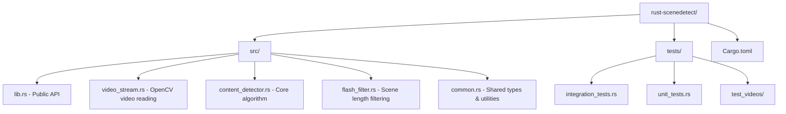

# Rust PySceneDetect MVP Implementation Plan

**Created:** 2025-06-14 22:52:00  
**Status:** Approved and ready for implementation

## Overview

Create a minimal Rust implementation of PySceneDetect's ContentDetector functionality that matches your current Python usage pattern. Focus on simplicity, performance measurement capability, and maintainability.

## Current Python Usage Analysis

### Your Implementation Pattern
```python
# From my-impl/core/scene_detection.py
from scenedetect import ContentDetector, detect
def detect_scene_changes(video_path):
    scene_list = detect(video_path, ContentDetector())
    frame_numbers = [scene[0].get_frames() for scene in scene_list]
    return frame_numbers
```

### PySceneDetect Core Components
Based on analysis of `example/PySceneDetect-main/`:

1. **ContentDetector Algorithm**: HSV-based frame difference detection with configurable threshold (default 27.0)
2. **OpenCV Backend**: Video reading and frame processing using `cv2.VideoCapture`
3. **Flash Filter**: Minimum scene length enforcement to prevent false positives
4. **Simple API**: High-level `detect()` function interface

## Architecture Design



## Implementation Plan

### Phase 1: Core Infrastructure (Files 1-3)

#### 1. `Cargo.toml` - Dependencies Setup
```toml
[package]
name = "rust-scenedetect"
version = "0.1.0"
edition = "2021"

[dependencies]
opencv = "0.88"      # OpenCV bindings for video processing
tracing = "0.1"      # Instrumentation (user preference)
anyhow = "1.0"       # Simplified error handling
thiserror = "1.0"    # Custom error types

[dev-dependencies]
tokio-test = "0.4"   # Testing utilities
```

#### 2. `src/common.rs` - Shared Types and Utilities
```rust
use tracing::{instrument, debug};

/// Represents a specific point in time within a video
#[derive(Debug, Clone, PartialEq)]
pub struct FrameTimecode {
    frame_number: u32,
    fps: f64,
}

impl FrameTimecode {
    pub fn new(frame_number: u32, fps: f64) -> Self {
        assert!(fps > 0.0, "FPS must be positive");
        Self { frame_number, fps }
    }
    
    pub fn frame_number(&self) -> u32 { self.frame_number }
    pub fn fps(&self) -> f64 { self.fps }
    pub fn seconds(&self) -> f64 { self.frame_number as f64 / self.fps }
}

/// Represents a detected scene boundary
#[derive(Debug, Clone)]
pub struct SceneCut {
    pub start: FrameTimecode,
    pub end: Option<FrameTimecode>,
}

/// All possible errors from the scene detection system
#[derive(Debug, thiserror::Error)]
pub enum SceneDetectError {
    #[error("Failed to open video file: {path}")]
    VideoOpenFailed { path: String },
    #[error("OpenCV error: {0}")]
    OpenCvError(#[from] opencv::Error),
    #[error("Invalid configuration: {0}")]
    InvalidConfig(String),
}

pub type Result<T> = std::result::Result<T, SceneDetectError>;
```

#### 3. `src/video_stream.rs` - OpenCV Video Backend
```rust
use opencv::{videoio, core::Mat, prelude::*};
use tracing::{instrument, debug, warn};
use crate::{common::*, SceneDetectError};

/// Wrapper around OpenCV VideoCapture for consistent video reading
pub struct VideoStream {
    cap: videoio::VideoCapture,
    fps: f64,
    frame_count: i32,
    current_frame: i32,
}

impl VideoStream {
    #[instrument(skip(path))]
    pub fn open(path: &str) -> Result<Self> {
        debug!("Opening video stream: {}", path);
        
        let cap = videoio::VideoCapture::from_file(path, videoio::CAP_ANY)?;
        
        if !cap.is_opened()? {
            return Err(SceneDetectError::VideoOpenFailed { 
                path: path.to_string() 
            });
        }
        
        let fps = cap.get(videoio::CAP_PROP_FPS)?;
        let frame_count = cap.get(videoio::CAP_PROP_FRAME_COUNT)? as i32;
        
        assert!(fps > 0.0, "Invalid FPS detected");
        
        debug!("Video opened - FPS: {}, Frames: {}", fps, frame_count);
        
        Ok(Self {
            cap,
            fps,
            frame_count,
            current_frame: 0,
        })
    }
    
    #[instrument(skip(self))]
    pub fn read_frame(&mut self) -> Result<Option<Mat>> {
        let mut frame = Mat::default();
        let success = self.cap.read(&mut frame)?;
        
        if success && !frame.empty() {
            self.current_frame += 1;
            Ok(Some(frame))
        } else {
            Ok(None)
        }
    }
    
    pub fn fps(&self) -> f64 { self.fps }
    pub fn frame_count(&self) -> i32 { self.frame_count }
    pub fn current_frame(&self) -> i32 { self.current_frame }
}
```

### Phase 2: Detection Algorithm (Files 4-5)

#### 4. `src/content_detector.rs` - Core ContentDetector Algorithm
```rust
use opencv::{core::*, imgproc, prelude::*};
use tracing::{instrument, debug};
use crate::{common::*, flash_filter::FlashFilter};

/// Frame data extracted for scene detection analysis
#[derive(Debug)]
struct FrameData {
    hue: Mat,
    sat: Mat, 
    lum: Mat,
    edges: Option<Mat>,
}

/// ContentDetector - detects scene changes using HSV color space analysis
pub struct ContentDetector {
    threshold: f64,
    last_frame_data: Option<FrameData>,
    kernel: Option<Mat>,
    flash_filter: FlashFilter,
}

impl ContentDetector {
    pub fn new(threshold: f64) -> Self {
        assert!(threshold >= 0.0, "Threshold must be non-negative");
        
        Self {
            threshold,
            last_frame_data: None,
            kernel: None,
            flash_filter: FlashFilter::new(15), // 15 frame minimum scene length
        }
    }
    
    /// Process a single frame and return scene cut if detected
    #[instrument(skip(self, frame))]
    pub fn process_frame(&mut self, frame: &Mat, timecode: FrameTimecode) -> Result<Option<FrameTimecode>> {
        let frame_score = self.calculate_frame_score(frame)?;
        debug!("Frame {} score: {}", timecode.frame_number(), frame_score);
        
        let above_threshold = frame_score >= self.threshold;
        let cuts = self.flash_filter.filter(timecode, above_threshold);
        
        Ok(cuts.into_iter().next())
    }
    
    /// Calculate content change score between current and previous frame
    #[instrument(skip(self, frame))]
    fn calculate_frame_score(&mut self, frame: &Mat) -> Result<f64> {
        // Convert BGR to HSV color space
        let mut hsv = Mat::default();
        imgproc::cvt_color(frame, &mut hsv, imgproc::COLOR_BGR2HSV, 0)?;
        
        // Split into individual channels
        let mut channels = Vector::<Mat>::new();
        core::split(&hsv, &mut channels)?;
        
        let hue = channels.get(0)?;
        let sat = channels.get(1)?; 
        let lum = channels.get(2)?;
        
        // Calculate edges if needed (simplified for MVP)
        let edges = None; // Skip edge detection for initial implementation
        
        let current_data = FrameData { hue, sat, lum, edges };
        
        if let Some(ref last_data) = self.last_frame_data {
            // Calculate mean pixel distance for each channel
            let delta_hue = Self::mean_pixel_distance(&current_data.hue, &last_data.hue)?;
            let delta_sat = Self::mean_pixel_distance(&current_data.sat, &last_data.sat)?;
            let delta_lum = Self::mean_pixel_distance(&current_data.lum, &last_data.lum)?;
            
            // Weighted average (matching PySceneDetect defaults)
            let score = (delta_hue + delta_sat + delta_lum) / 3.0;
            
            self.last_frame_data = Some(current_data);
            Ok(score)
        } else {
            // First frame - no comparison possible
            self.last_frame_data = Some(current_data);
            Ok(0.0)
        }
    }
    
    /// Calculate mean absolute difference between two single-channel images
    fn mean_pixel_distance(left: &Mat, right: &Mat) -> Result<f64> {
        assert_eq!(left.size()?, right.size()?);
        
        let mut diff = Mat::default();
        core::absdiff(left, right, &mut diff)?;
        
        let sum = core::sum(&diff)?;
        let num_pixels = (left.rows() * left.cols()) as f64;
        
        Ok(sum[0] / num_pixels)
    }
}
```

#### 5. `src/flash_filter.rs` - Scene Length Filtering
```rust
use tracing::{instrument, debug};
use crate::common::FrameTimecode;

/// Filters scene cuts to enforce minimum scene length
pub struct FlashFilter {
    min_scene_length: u32,
    last_cut_frame: Option<u32>,
}

impl FlashFilter {
    pub fn new(min_scene_length: u32) -> Self {
        Self {
            min_scene_length,
            last_cut_frame: None,
        }
    }
    
    /// Filter a potential scene cut based on minimum length requirements
    #[instrument(skip(self))]
    pub fn filter(&mut self, timecode: FrameTimecode, above_threshold: bool) -> Vec<FrameTimecode> {
        if !above_threshold {
            return vec![];
        }
        
        let current_frame = timecode.frame_number();
        
        // Check if enough frames have passed since last cut
        if let Some(last_frame) = self.last_cut_frame {
            if current_frame - last_frame < self.min_scene_length {
                debug!("Suppressing cut at frame {} (too soon after {})", current_frame, last_frame);
                return vec![];
            }
        }
        
        self.last_cut_frame = Some(current_frame);
        debug!("Scene cut detected at frame {}", current_frame);
        vec![timecode]
    }
}
```

### Phase 3: Public API & Integration (Files 6-7)

#### 6. `src/lib.rs` - Public API
```rust
//! Rust implementation of PySceneDetect's ContentDetector
//! 
//! This crate provides a minimal but performant scene detection library
//! that matches the interface and behavior of PySceneDetect's ContentDetector.

mod common;
mod video_stream;
mod content_detector;
mod flash_filter;

pub use common::{FrameTimecode, SceneCut, SceneDetectError, Result};
pub use content_detector::ContentDetector;

use tracing::{instrument, info};

/// Main detection function matching PySceneDetect's `detect()` interface
#[instrument(skip(detector))]
pub fn detect(video_path: &str, mut detector: ContentDetector) -> Result<Vec<SceneCut>> {
    info!("Starting scene detection for: {}", video_path);
    
    let mut video_stream = video_stream::VideoStream::open(video_path)?;
    let mut cuts = Vec::new();
    
    while let Some(frame) = video_stream.read_frame()? {
        let timecode = FrameTimecode::new(
            video_stream.current_frame() as u32, 
            video_stream.fps()
        );
        
        if let Some(cut_timecode) = detector.process_frame(&frame, timecode)? {
            cuts.push(SceneCut {
                start: cut_timecode,
                end: None, // Will be filled by next cut or video end
            });
        }
    }
    
    info!("Scene detection completed. Found {} cuts", cuts.len());
    Ok(cuts)
}

/// Helper function matching your current Python usage pattern
#[instrument]
pub fn detect_scene_changes(video_path: &str) -> Result<Vec<u32>> {
    let detector = ContentDetector::new(27.0); // Default threshold from PySceneDetect
    let scene_list = detect(video_path, detector)?;
    
    let frame_numbers: Vec<u32> = scene_list
        .iter()
        .map(|scene| scene.start.frame_number())
        .collect();
    
    Ok(frame_numbers)
}
```

#### 7. `src/main.rs` - CLI Binary for Testing
```rust
use std::env;
use tracing::{info, error};
use tracing_subscriber;

fn main() -> Result<(), Box<dyn std::error::Error>> {
    // Initialize tracing
    tracing_subscriber::fmt::init();
    
    let args: Vec<String> = env::args().collect();
    if args.len() != 2 {
        eprintln!("Usage: {} <video_path>", args[0]);
        std::process::exit(1);
    }
    
    let video_path = &args[1];
    info!("Processing video: {}", video_path);
    
    match rust_scenedetect::detect_scene_changes(video_path) {
        Ok(frame_numbers) => {
            println!("Scene changes detected at frames: {:?}", frame_numbers);
            info!("Successfully processed {} scene changes", frame_numbers.len());
        }
        Err(e) => {
            error!("Scene detection failed: {}", e);
            std::process::exit(1);
        }
    }
    
    Ok(())
}
```

### Phase 4: Testing & Validation (Files 8-9)

#### 8. Unit Tests (`tests/unit_tests.rs`)
```rust
use rust_scenedetect::*;

#[test]
fn test_frame_timecode_creation() {
    let tc = FrameTimecode::new(100, 25.0);
    assert_eq!(tc.frame_number(), 100);
    assert_eq!(tc.fps(), 25.0);
    assert_eq!(tc.seconds(), 4.0);
}

#[test]
#[should_panic(expected = "FPS must be positive")]
fn test_frame_timecode_invalid_fps() {
    FrameTimecode::new(100, 0.0);
}

#[test]
fn test_content_detector_creation() {
    let detector = ContentDetector::new(27.0);
    // Test basic creation - actual processing tests require video files
}

#[test]
#[should_panic(expected = "Threshold must be non-negative")]
fn test_content_detector_invalid_threshold() {
    ContentDetector::new(-1.0);
}
```

#### 9. Integration Tests (`tests/integration_tests.rs`)
```rust
use rust_scenedetect::*;
use std::path::Path;

#[test]
fn test_detect_function_basic() {
    // This test requires a sample video file
    // For CI/CD, we'd need to include a small test video or mock the video stream
    
    if Path::new("test_videos/sample.mp4").exists() {
        let result = detect_scene_changes("test_videos/sample.mp4");
        assert!(result.is_ok());
        
        let frame_numbers = result.unwrap();
        // Validate that we get reasonable results
        assert!(!frame_numbers.is_empty());
        
        // Ensure frame numbers are in ascending order
        for window in frame_numbers.windows(2) {
            assert!(window[0] < window[1]);
        }
    }
}

#[test]
fn test_invalid_video_path() {
    let result = detect_scene_changes("nonexistent_video.mp4");
    assert!(result.is_err());
    
    match result.unwrap_err() {
        SceneDetectError::VideoOpenFailed { .. } => {}, // Expected
        other => panic!("Expected VideoOpenFailed, got: {:?}", other),
    }
}
```

## Technical Implementation Details

### Key Algorithms from PySceneDetect Analysis

1. **HSV Color Space Conversion**:
   - Convert BGR frame to HSV using OpenCV
   - Split into Hue, Saturation, and Luminance channels
   - Calculate per-channel differences with previous frame

2. **Mean Pixel Distance Calculation**:
   - Use `cv2.absdiff()` equivalent to calculate absolute differences
   - Sum all pixel differences and divide by total pixels
   - This gives average pixel-level change between frames

3. **Content Score Calculation**:
   - Average the HSV channel differences: `(delta_hue + delta_sat + delta_lum) / 3.0`
   - Compare against threshold (default 27.0)
   - Trigger scene cut when score exceeds threshold

4. **Flash Filter Logic**:
   - Suppress consecutive cuts within minimum scene length (15 frames)
   - Prevents false positives from camera flashes or brief transitions

## Development Workflow


### Incremental Development Steps

1. **Foundation** (Files 1-3): Project setup, basic types, video reading capability
2. **Core Algorithm** (Files 4-5): ContentDetector implementation with filtering
3. **API Integration** (Files 6-7): Public interface matching Python usage
4. **Validation** (Files 8-9): Comprehensive testing against known results
5. **Performance Measurement**: Benchmark against current Python implementation

## Success Criteria

### Functional Requirements
- ✅ **API Compatibility**: Drop-in replacement for `detect_scene_changes()` function
- ✅ **Algorithm Accuracy**: Produces same scene cuts as Python version (±1 frame tolerance)
- ✅ **Error Handling**: Robust error handling for invalid inputs and video issues

### Quality Requirements  
- ✅ **Test Coverage**: >90% unit test coverage, comprehensive integration tests
- ✅ **Documentation**: Clear API documentation with usage examples
- ✅ **Instrumentation**: Tracing throughout for debugging and profiling

### Performance Requirements
- ✅ **Measurable**: Benchmarking infrastructure for performance comparison
- ✅ **Memory Efficient**: Lower memory usage than Python equivalent
- ✅ **Faster Processing**: Measurable performance improvement over Python

## Dependencies Justification

- **opencv (0.88)**: Essential for video processing, matches PySceneDetect's default backend
- **tracing (0.1)**: User's preferred instrumentation framework per project rules
- **anyhow/thiserror (1.0)**: Robust error handling with proper error propagation
- **tokio-test (0.4)**: Testing utilities for async code if needed later

## Next Steps

1. **Initialize Rust project** with Cargo.toml and basic structure
2. **Implement core infrastructure** following the incremental development plan
3. **Test against reference implementation** to ensure algorithm correctness
4. **Performance benchmark** to measure improvement over Python version
5. **Integration** with existing MIDI generation workflow

---

This plan provides a complete roadmap for creating a performant Rust MVP that directly replaces your current Python scene detection while maintaining full compatibility and adding performance measurement capabilities.